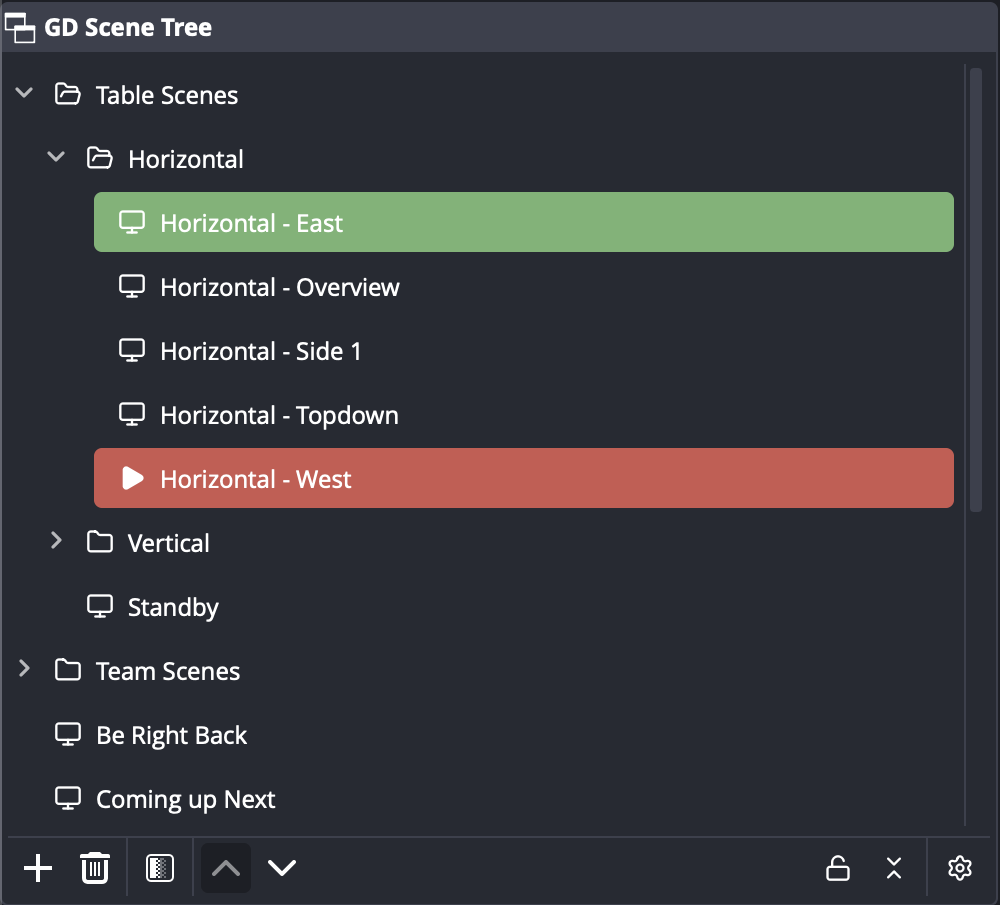

# GD Scene Tree

An OBS Studio dock that shows your scenes as a tree with folders. It replaces the
scene organiser from other plugin bundles with one focused dock, without the rest.



## Features

- Folders for scenes, nested as deep as you like, with drag and drop. Select
  several scenes with Ctrl or Shift to move, remove, hide, colour or icon them
  together.
- Undo and redo through OBS's own Edit menu and shortcuts, for tree changes as
  well as adding, removing, renaming and duplicating scenes.
- Click a scene to select it. In studio mode a click sets the preview and a
  double-click transitions to program. Both can be changed in the settings.
- The program scene is marked red with a play icon, the preview scene green.
- The same toolbar as the Scenes dock: add, remove, filters, move up and down,
  plus lock, collapse all and settings.
- Right-click menu with the OBS scene actions: duplicate, copy and paste
  filters, rename, remove, order, scene projector, screenshot, filters,
  transition override and multiview. On top of that: hide scene, set colour,
  set icon, sort, new folder and lock.
- Per-scene icons from a bundled set of about a hundred Lucide icons.
- Optional search field, row height, icon toggle, hidden scenes and automatic
  sorting in the settings dialog.
- The folder layout is saved inside the scene collection, so every collection
  keeps its own tree and it travels with an export of the collection.
- Import and export the tree as JSON. Exported trees reference scenes by name as
  well as by UUID, so they apply on another machine.
- Public OBS APIs only. Adding and removing scenes goes through the plugin's
  own dialogs and libobs, not through OBS's private window actions.
- Migration from StreamUP: if StreamUP's scene organiser data exists for a
  collection that has no tree yet, its folders are imported on first load. The
  settings dialog can repeat that import at any time.

## Installation

Download the package for your platform from the
[releases page](https://github.com/ronplanken/gd-scene-tree/releases).

| Platform | File | Notes |
| --- | --- | --- |
| Windows | `gd-scene-tree-<version>-windows-x64-installer.exe` | Installs for all users. Close OBS first. |
| Windows | `gd-scene-tree-<version>-windows-x64.zip` | Unzip into `%ProgramData%\obs-studio\plugins\`. |
| macOS | `gd-scene-tree-<version>-macos-universal.pkg` | Universal build for Apple Silicon and Intel. |
| Ubuntu | `gd-scene-tree-<version>-x86_64-linux-gnu.deb` | Ubuntu 24.04 and compatible. |

OBS Studio 31 or newer is required. Restart OBS after installing. The dock
appears as **GD Scene Tree**; enable it from the **Docks** menu if it is hidden.

### Unsigned packages

The packages are not code signed, so both Windows and macOS warn on first run.
The files are built by GitHub Actions from the tagged source; compare the
SHA-256 in the release notes if you want to check a download.

**Windows.** SmartScreen shows "Windows protected your PC". Click **More info**,
then **Run anyway**. The UAC prompt lists the publisher as unknown; the file
properties show Ron Planken as the company.

**macOS.** Opening the pkg shows "Apple could not verify" with no option to
continue. Click **Done**, open **System Settings**, go to **Privacy & Security**,
scroll down to the message about the blocked package and click **Open Anyway**.
On macOS 13 and 14 you can instead right-click the pkg and choose **Open**.

## Usage

- Right-click anywhere in the tree for the context menu. Right-click empty space
  to add a scene or folder at the root.
- Drag scenes into folders or between folders. Folders can hold folders.
- The gear button at the right of the toolbar opens the settings dialog with
  four sections: Display, Behaviour, Automatic scene sorting, Import and export.
- The lock button freezes the tree: no drag and drop, renaming, hiding, colours
  or sorting until it is unlocked. The lock state is saved per scene collection.

## Building

The project is based on the
[OBS plugin template](https://github.com/obsproject/obs-plugintemplate) and
builds with its presets.

```sh
cmake --preset macos          # or windows-x64, ubuntu-x86_64
cmake --build --preset macos
```

macOS builds need Xcode, Windows builds need Visual Studio 2022, and Ubuntu
builds need the packages listed in the template's build guide. The CMake
configure step downloads the matching OBS sources and prebuilt dependencies.

## Releases

Every push builds all three platforms. Pushing a tag of the form `1.2.3` also
packages them, builds the Windows installer, and creates a GitHub release with
the installer, the zip, the macOS package and the Ubuntu package attached.

The release is created as a draft with the SHA-256 checksums in its notes.
Review it on GitHub and publish it by hand.

Packages are not code signed. The macOS build is ad-hoc signed so it loads on
Apple Silicon, and the Windows installer and plugin carry the author name in
their version information. Signing and notarisation switch on automatically if
the signing secrets from the OBS plugin template are added to the repository.

## Licence

GD Scene Tree is released under the GPL-2.0 licence, see [LICENSE](LICENSE).
Icons are from [Lucide](https://lucide.dev), ISC licence, bundled in
`data/icons`.
